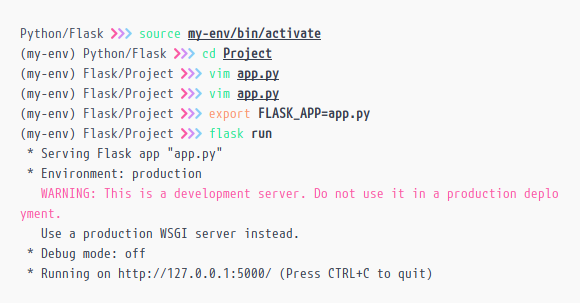
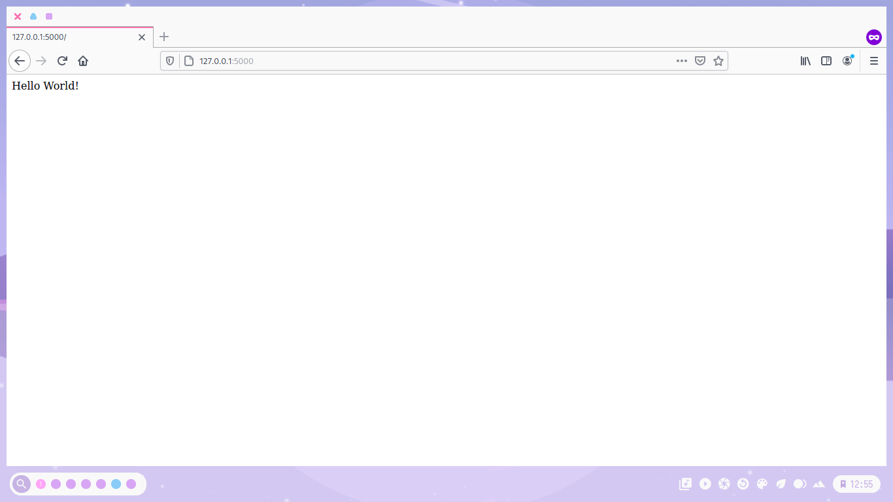

Aplikasi yang menggunakan Flask antara lain adalah Pinterest, LinkedIn, dan halaman web komunitas situs Flask itu sendiri.
<!--more-->
Flask disebut kerangka kerja mikro karena tidak membutuhkan alat-alat tertentu atau pustaka.Flask mendukung ekstensi yang dapat menambahkan fitur aplikasi seolah-olah mereka diimplementasikan dalam Flask itu sendiri.
Ekstensi yang ada seperti pemetaan objek-relasional, validasi form, penanganan unggahan, berbagai teknologi otentikasi terbuka, lapisan abstraksi basisdata, validasi form, atau komponen lain.

### Fitur Flask

- Berisi pengembangan server dan pengawakutu
- Dukungan terintegrasi untuk pengujian unit
- RESTful request dispatching
- Menggunakan Jinja2 template engine
- Dukungan untuk secure cookies (sisi klien sesi)
- 100% WSGI 1.0 compliant
- Berbasis Unicode
- Dokumentasi yang ekstensif
- Kompatibilitas dengan Google App Engine
- Ekstensi yang tersedia untuk meningkatkan fitur-fitur yang diinginkan

### Pemasangannya

Pertama install flask dengan memasukkan perintah

```bash
pip install flask
```

Untuk menge-checnya bisa memasukkan perintah

```bash
pip list
```

Jika sudah selesai install flasknya selanjutnya bisa buat folder untuk memulai projek kita,
Jika sudah buat foldenya kemudian buat file dengan nama *app.py*
kalian bisa mengeditnya dengan text editor kesukaan kalian.
Masukkan Kode berikut ke dalam *app.py*

```python
from flask import Flask

app = Flask(__name__)


@app.route("/")

def hello():

    return "Hello World!"


```

Kita export dulu, untuk export bisa memasukkan perintah berikut

```bash
 export FLASK_APP=app.py
```

dalam **export FLASK_APP=app.py** app.py itu sesuai file yang anda buat tadi, jika sudah di export kita tinggal menjalankannya, untuk menjalankannya bisa memasukkan peintah

```bash
flask run
```



Copykan alamatnya di browser anda *<http://127.0.0.1:5000/>*
Jika berhasil akan tampil seperti berikut di browser anda


Dan untuk cara agar bisa restart server otomatis bisa memasukkan perintah berikut

```bash
FLASK_APP=app.py FLASK_DEBUG=1 python -m flask run
```

code di atas itu supaya servernya bisa restart otomatis ketika kita mengubah codenya.

> Referensi : <https://id.wikipedia.org/wiki/Flask>

Aplikasi yang menggunakan Flask antara lain adalah Pinterest, LinkedIn, dan halaman web komunitas situs Flask itu sendiri.
Flask disebut kerangka kerja mikro karena tidak membutuhkan alat-alat tertentu atau pustaka.Flask mendukung ekstensi yang dapat menambahkan fitur aplikasi seolah-olah mereka diimplementasikan dalam Flask itu sendiri.
Ekstensi yang ada seperti pemetaan objek-relasional, validasi form, penanganan unggahan, berbagai teknologi otentikasi terbuka, lapisan abstraksi basisdata, validasi form, atau komponen lain.

### Fitur Flask

- Berisi pengembangan server dan pengawakutu
- Dukungan terintegrasi untuk pengujian unit
- RESTful request dispatching
- Menggunakan Jinja2 template engine
- Dukungan untuk secure cookies (sisi klien sesi)
- 100% WSGI 1.0 compliant
- Berbasis Unicode
- Dokumentasi yang ekstensif
- Kompatibilitas dengan Google App Engine
- Ekstensi yang tersedia untuk meningkatkan fitur-fitur yang diinginkan

### Pemasangannya

Pertama install flask dengan memasukkan perintah

```bash
pip install flask
```

Untuk menge-checnya bisa memasukkan perintah

```bash
pip list
```

Jika sudah selesai install flasknya selanjutnya bisa buat folder untuk memulai projek kita,
Jika sudah buat foldenya kemudian buat file dengan nama *app.py*
kalian bisa mengeditnya dengan text editor kesukaan kalian.
Masukkan Kode berikut ke dalam *app.py*

```python
from flask import Flask

app = Flask(__name__)


@app.route("/")

def hello():

    return "Hello World!"


```

Kita export dulu, untuk export bisa memasukkan perintah berikut

```bash
 export FLASK_APP=app.py
```

dalam **export FLASK_APP=app.py** app.py itu sesuai file yang anda buat tadi, jika sudah di export kita tinggal menjalankannya, untuk menjalankannya bisa memasukkan peintah

```bash
flask run
```


Copykan alamatnya di browser anda *<http://127.0.0.1:5000/>*
Jika berhasil akan tampil seperti berikut di browser anda


Dan untuk cara agar bisa restart server otomatis bisa memasukkan perintah berikut

```bash
FLASK_APP=app.py FLASK_DEBUG=1 python -m flask run
```

code di atas itu supaya servernya bisa restart otomatis ketika kita mengubah codenya.

> Referensi : <https://id.wikipedia.org/wiki/Flask>
