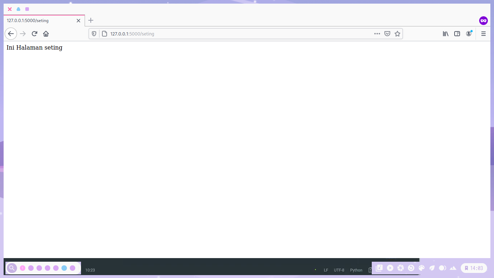
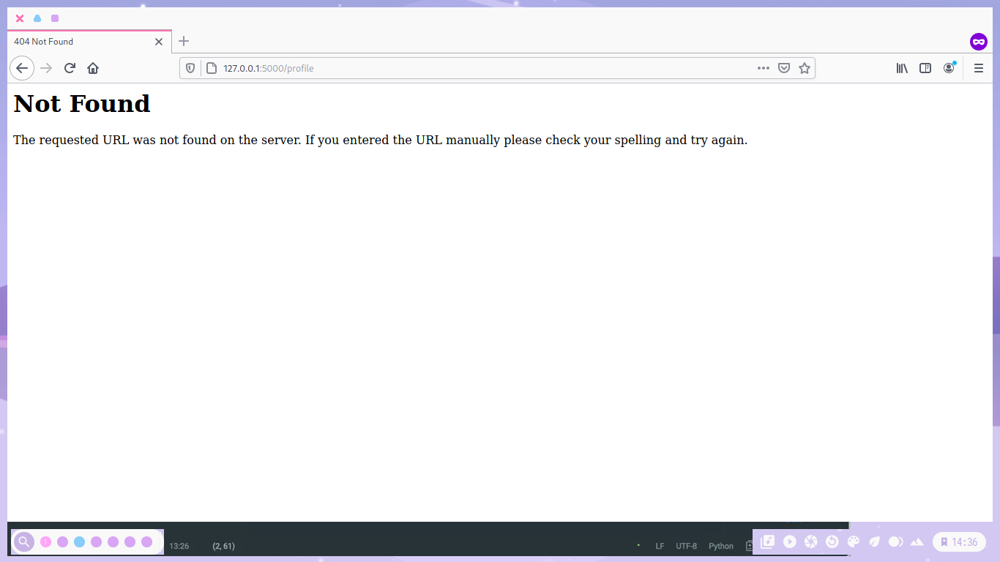
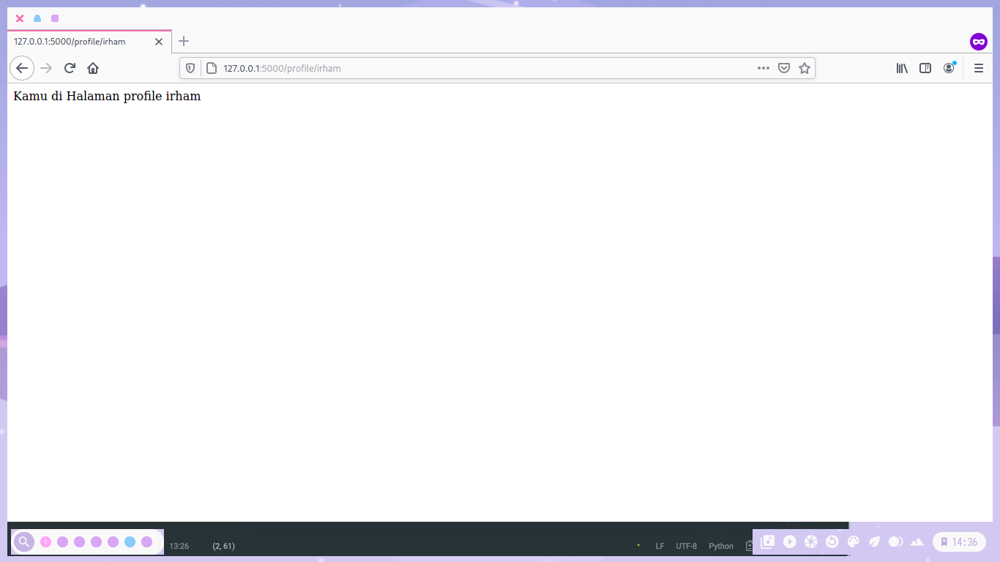
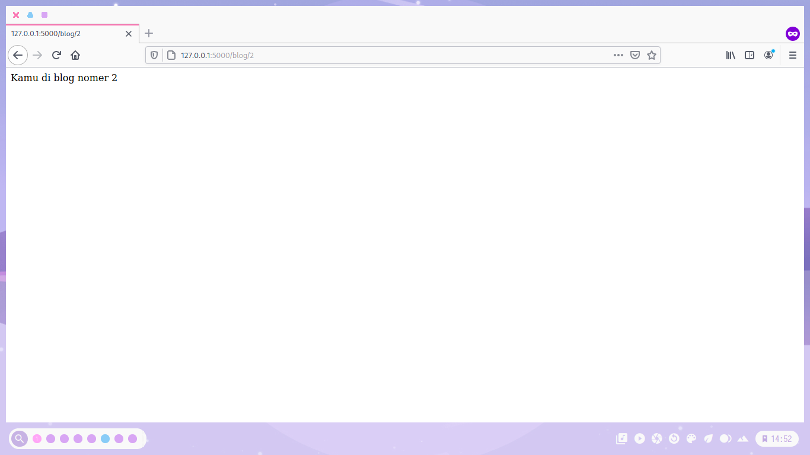

Dalam dunia web development, trayek/jalan yang dimaksud adalah jalan menuju sebuah aplikasi berbasis web,
<!--more-->
jadi bisa kita sebut, router merupakan suatu modul dalam aplikasi yang berfungsi untuk mengatur jalan/rute pada aplikasi berbasis web.

Router mengatur pintu masuk yang berupa request pada aplikasi, mereka memilah dan mengolah request url untuk kemudian diproses sesuai dengan tujuan akhir url tersebut. Bisa jadi url tersebut berfungsi untuk mengambil data kemudian menampilkannya, menghapus data, menampilkan form, sampai mengolah session.
Kali ini kita akan belajar routing pada flask.
sebelumnya kita sudah membuat projek dengan nama file *app.py*.

```python
from flask import Flask

app = Flask(__name__)


@app.route("/")
def hello():
    return "Hello World!"

```

Untuk membuat routing kita edit menjadi seperti ini,
Ini adalah routing statis

```python
from flask import Flask

app = Flask(__name__)


@app.route("/")
def index():
    return "Hello World!"

# Routing Statis
@app.route("/seting")
def show_seting:
    return "Ini halaman Seting"

```

Untuk menjalankannya bisa memasukkan perinta di bawah agar server restart otomatis

```bash
FLASK_APP=app.py FLASK_DEBUG=1 python -m flask run
```

Masukkan alamat *<http://127.0.0.1:5000/>* di web browser anda, dan untu mencoba routing yg tadi di buat masukkan alamat dengan menambahkan nama routing tsb.
Saya tadi membuat dg nama *seting* maka untuk mencobanya saya memasukkan alamatnya seperti ini *<http://127.0.0.1:5000/seting>*

Maka akan muncul seperti ini



Itu tadi jenis routing statis kita akan belajar routing dinamis,
routing dinamis bisa di buat dengan cara seperti berikut

```python
from flask import Flask
app = Flask(__name__)

@app.route("/")
def index():
    return "Hello World!"

# Routing Statis
@app.route("/seting")
def show_seting():
    return "Ini Halaman seting"

# Routing Dinamis
@app.route("/profile/<username>")
def show_profile(username):
    return "Kamu di Halaman profile %s" % username

```

Untuk menjalankannya sama seperti routing ststis,


Tetapi jika kita memasukkan alamatnya *<http://127.0.0.1:5000/profile>*  seperti routing statis akan muncul halaman Not Found seperti di atas.
Kita Hasus memasukkan alamatnya seperti ini *<http://127.0.0.1:5000/profile/Irham>*
maka akan tampil seperti berikut



Kita Juga bisa membuat Routing dinamis dengan tipe data integer, kita akan membuatnya seperti berikut

```python
@app.route("/blog/<int:blog_id>")
def show_blog(blog_id):
    return "Kamu di blog nomer %d" % blog_id
```

Jadi seperti beikut

```python
from flask import Flask
app = Flask(__name__)

@app.route("/")
def index():
    return "Hello World!"

# Routing Statis
@app.route("/seting")
def show_seting():
    return "Ini Halaman seting"

# Routing Dinamis
@app.route("/profile/<username>")
def show_profile(username):
    return "Kamu di Halaman profile %s" % username

@app.route("/blog/<int:blog_id>")
def show_blog(blog_id):
    return "Kamu di blog nomer %d" % blog_id
```

Jika tidak ada eror akan tampil seperti berikut



