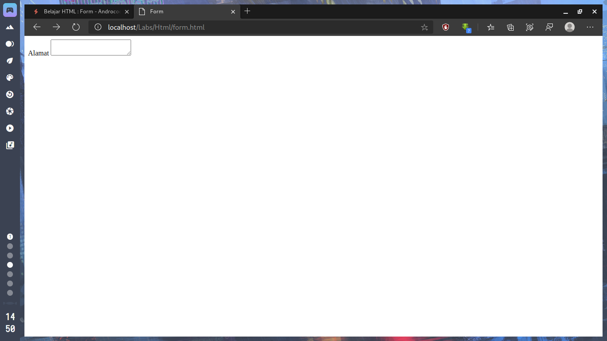

Dalam sebuah website biasanya terdapat satu
atau lebih form, seperti form pencarian, registrasi dan lain sebagainya.
<!--more-->
Form ini biasa digunakan untuk mengumpulkan data dari pengunjung website.<br>
Sebuah  form, boleh jadi memiliki beragam kontrol, mulai dari text input,
Combo box, Button dan lain sebagainya.<br>
Kita akan mempelajari sebagian kontrol yang disebutkan diatas karena kontrol di atas adalah yang paling sering digunakan
dalam halaman web.<br>
Pertama-tama, pembuatan sebuah form
diawali dengan tag _form_, dan setiap kontrol-kontrol yang dibutuhkan ditempatkan di dalam tag ini.
```html
<form>
    <h1>Formulir Pendaftaran</h1>
</form>
```
### Control-control Form
Setiap control pada form dapat dibuat dengan menggunakan tag _input_. Dan yang
membedakan tipe dari control tersebut berada pada atribut type (tipe kontrol). Berikut
ini adalah sebagian tipe kontrol yang biasa ditemui :

### Label
Label digunakan untuk memberikan keterangan pada setiap input yang ada. Jika anda
perhatikan formulir pendaftaran situs yahoo, yang disebut dengan label adalah yang
ditandai berikut ini :


```html
<label for="name"> Keterangan Input </label>
```
Atribut for diisi dengan isi dari atribut name pada kontrol yang ingin diberi label.

### Text
Control input ini dapat diisi dengan teks yang memiliki kata yang tidak terlalu
panjang/hanya satu baris, biasa digunakan dalam form pencarian, nama dan lain
sebagainya.
```html
<label for="nama">Nama Lengkap</label>
<input type="text" name="nama" />
```


Label adalah tulisan Nama, alamat, kota

Jika text input yang akan ditampilkan ingin memiliki nilai, maka tuliskan nilai tersebut di
dalam atribut value.
```html
<input type="text" name="nama" value="Androcode" />
```

### Text Area
Sama halnya dengan Input Text, namun textarea dapat diisi lebih dari satu baris, cocok
digunakan untuk isian yang panjang, seperti alamat, deskripsi, atau biodata.
Berbeda dengan kontrol lainnya yang menggunakan tag _input_, text area memiliki tag
sendiri yaitu _textarea></textarea_ . Dan apa yang terdapat di dalam tag ini adalah value dari
kontrol tersebut.

```html
<label for="alamat">Alamat Lengkap</label>
<textarea name="alamat"></textarea>
```



### Combo Box
Combo Box adalah kontrol yang memiliki pilihan ketika diklik. Pembuatannya sama
seperti pembuatan Daftar/List namun dengan tag yang berbeda.

```html
<label for=‚kota‛>Kota</label>
<select name=‚kota‛>
    <option>Jepara</option>
    <option>Kudus</option>
    <option>Pati</option>
</select>
```


### Submit/Button
Submit atau Button, berupa tombol yang dapat di klik. Penggunaan atribut value pada
kontrol ini akan merubah text yang ada di dalamnya.

```html
<input type="submit" value="kirim" />
```


Sebagai latihan, kita coba menggabungkan kontrol-kontrol yang telah anda pelajari
sebelumnya menjadi satu form utuh.<br>
Buatlah file baru, dengan nama file *form.html* , lalu ketikkan kode HTML berikut pada
file *form.html*
```html
<!DOCTYPE HTML>
<HTML>
<head>
    <title>Form</title>
</head>
<body>
    <form>
    <label for="nama">Nama</label>
    <input type="text" name="nama"><br>
    <label for="alamat">Alamat</label>
    <textarea name="alamat"></textarea><br>

    <label for="kota">Kota</label>
    <select name="kota">
        <option>Jepara</option>
        <option>Kudus</option>
        <option>Pati</option>
    </select><br>
    <input type="submit" value="kirim">
</form>
</body>
</HTML>
```

