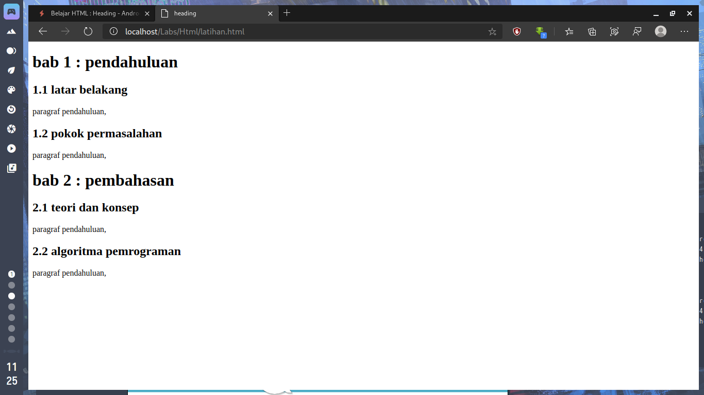

Heading, digunakan untuk memberikan penjudulan pada suatu dokumen HTML.
Bayangkanlah sebuah skripsi atau buku yang memiliki bab dan subbab-subbab di
dalamnya.
<!--more-->
## Heading
Untuk memformat penjudulan dalam HTML, kita gunakan tag _h1_ untuk
judul utama dan untuk judul subbabnya anda dapat menggunakan tag _h2_ sampai
dengan _h6_ .<br>
Setiap level judul memiliki ukuran huruf yang berbeda-beda (namun anda masih bisa
merubah ukurannya melalui CSS).<br>
Sebagai latihan, buatlah file HTML baru dengan nama *latihan.html* lalu ketikkan kode
HTML berikut:
```html
<!doctype html>
<html lang=‚en-us‛>
<head>
    <title>heading</title>
</head>
<body>
    <h1>bab 1 : pendahuluan</h1>
        <h2>1.1 latar belakang</h2>
            <p>paragraf pendahuluan,
    <h2>1.2 pokok permasalahan</h2>
        <p>paragraf pendahuluan,
    <h1>bab 2 : pembahasan</h1>
        <h2>2.1 teori dan konsep</h2>
            <p>paragraf pendahuluan,
    <h2>2.2 algoritma pemrograman</h2>
        <p>paragraf pendahuluan,
</body>
</html>
```



Adanya penjudulan dimaksudkan agar suatu dokumen HTML lebih terstruktur layaknya sebuah dokumen resmi seperti skripsi/paper yang mengharuskan adanya perbedaanantara Bab utama dan sub-babnya.
