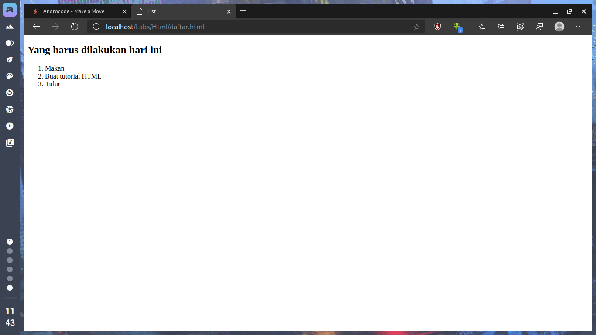
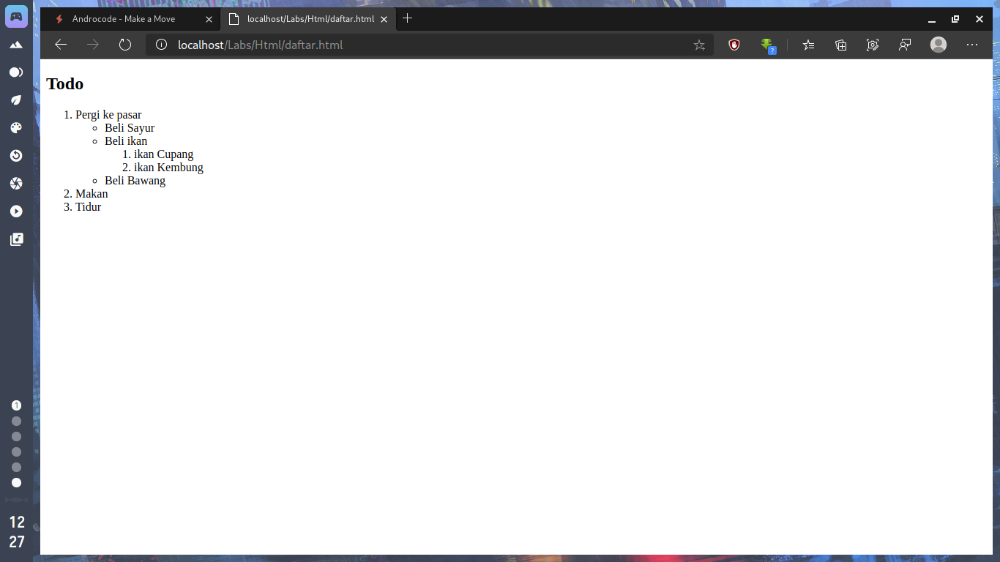

Sebuah daftar dapat memiliki penomoran atau hanya sebuah simbol berupa lingkaran
atau bentuk lainnya.
<!--more-->
## Membuat daftar/list
Dalam HTML, daftar yang menggunakan penomoran disebut
dengan _ordered list_ dan yang menggunakan simbol disebut dengan _unordered list_.

### Ordered List
Ordered list atau Daftar berurutan dapat dibuat dengan menggunakan tag **ol**
(singkatan dari ordered list) dan untuk setiap listnya kita gunakan tag **li** (singkatan
dari list item/item daftar). Sebagai contoh, perhatikan kode HTML berikut :
```html
<!doctype html>
<html lang=‚en-us‛>
<head>
    <title>List</title>
</head>
<body>
    <h2>Yang harus dilakukan hari ini</h2>
    <ol>
        <li>Makan</li>
        <li>Buat tutorial HTML</li>
        <li>Tidur</li>
    </ol>
</body>
</html>
```
Penomoran daftar akan dilakukan secara otomatis ketika anda menambahkan daftar
item.<br>



### Unordered List
Berbeda dengan daftar berurut, unordered list akan menandai setiap item dengan
simbol. Baik berupa lingkaran atau persegi (anda masih bisa merubahnya dengan CSS).<br>
Untuk membuat daftar tidak berurut kita gunakan tag _ul_ dan seperti tag _ol_,<br> item
yang terdapat di dalamnya harus diapit dengan tag _li_.<br>
Jika kita modifikasi contoh sebelumnya dengan merubah _ol_ menjadi _ul_ maka yang
akan kita dapat adalah seperti berikut :
```html
<!doctype html>
<html lang=‚en-us‛>
<head>
    <title>List</title>
</head>
<body>
    <h2>Yang harus dilakukan hari ini</h2>
    <Ul>
        <li>Makan</li>
        <li>Buat tutorial HTML</li>
        <li>Tidur</li>
    </ul>
</body>
</html>
```


Secara default, item akan ditandai dengan lingkaran.

### Definition List
Berbeda dengan Ordered List dan Unordered List yang memiliki struktur sama, Data list
memiliki struktur tersendiri.<br>
Biasanya data list ini digunakan untuk membuat daftar
istilah beserta definisinya seperti halnya dalam kamus.
Tag _dt_ (definition term) digunakan untuk menampung istilah yang akan didefinisikan,
dan tag _dd_ digunakan untuk menuliskan definisi dari _dt_ sebelumnya.<br>
Berikut contoh penggunaan dari Definition List :
```html
<!doctype html>
<html lang=‚en-us‛>
<head>
    <title>List</title>
</head>
<body>
    <dl>
    <dt>Manga</dt>
        <dd>Manga (baca: man-ga, atau ma-ng-ga) merupakan kata komik dalam bahasaJepang; di luar Jepang, kata tersebut digunakan khusus untuk membicarakan tentang komik Jepang. </dd>
    <dt>Mangaka</dt>
        </dd>Mangaka (baca: menggambar manga  man-ga-ka, atau ma-ng-ga-ka) adalah orang yang menggambar manga </dd>
    </dl>
</body>
</html>
```

### List/Daftar bersarang
Sebuah daftar bisa saja memiliki daftar lagi di dalamitemnya, atau biasa kita sebut
dengan daftar/list bersarang (nested list). Contohnya seperti pada latihan yang akan kita
buat berikut.
Buat file baru dengan nama file latihan5.html lalu ketikkan kode HTML berikut :

```html
<!DOCTYPE html>
<html>
<head>
	<title></title>
</head>
<body>
	<h2>Todo</h2>
	<ol>
		<li>Pergi ke pasar
		<ul>
			<li>Beli Sayur</li>
			<li>Beli ikan
			<ol>
				<li>ikan Cupang</li>
				<li>ikan Kembung</li>
			</ol>
			</li>
			<li>Beli Bawang</li>
		</ul>
	</li>
	<li>Makan</li>
	<li>Tidur</li>
	</ol>
</body>
</html>
```


Yang perlu anda perhatikan adalah di mana anda meletakkan tag _ol_ atau _ul_ jika anda
ingin menempatkannya pada suatu item, yaitu sebelum penutup tag list item ( _/li_ ).<br>
Daftar seperti ini biasa digunakan untuk pembuatan menu website, atau keperluan
lainnya yang memang membutuhkan penomoran atau sesuatu yang memiliki poin-poin.