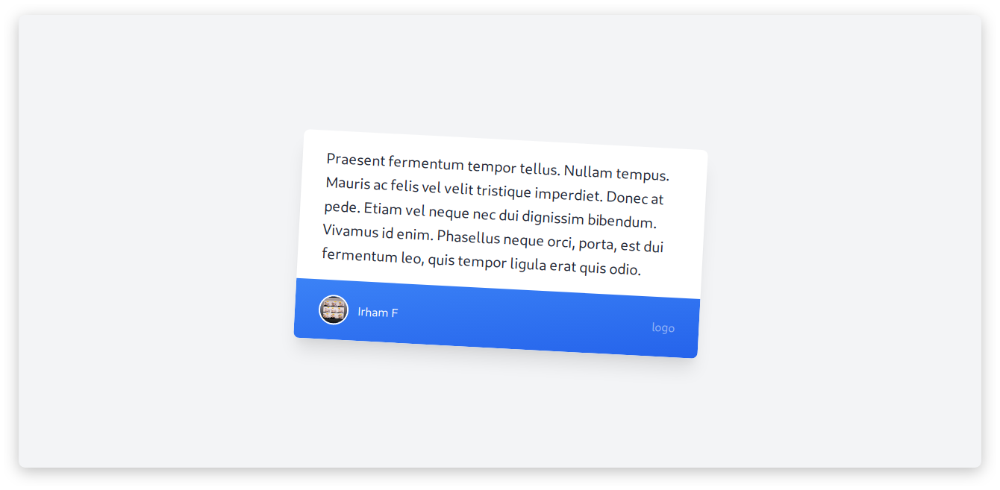

Hallo saya hari ini lagi mencoba belajar Taulwindcss, saya awalnya sedikit kesulitan bagaimana installnya dan menggunakanya.
Mungkin tulisan ini gak bisa jadi patokan bagaimana cara install dan penggunaanya dan saya lebih merekomendasika langsung dari Dokumentasi {{ newtabref  href="https://tailwindcss.com/docs/?ref=androcode.netlify.app" title="Tailwindcss" }} itu sendiri.

##### Kenapa gak pakai bootstrap aja ?
Saya pribadi masih menggunakan bootstrap untuk belajar" dan saya belajar Tailwindcss karna ingin mengetahui dan mempelajari
Framewrok-framewrok lain dari CSS gak ada kemungkinan nanti saya akan mempelajari yg lain.

Hal pertama yg saya lakukan sebelu belajar Tailwindcss adalah menginstall Tailwindcss itu sendiri dan hal-hal yg di butuhkan.
Pertama saya install **npm** karna saya menggunakan nodejs kalo teman-teman menggunakan **yarn** juga OK.

```bash
sudo pacman -S npm
```
Untuk install npm teman-teman bisa sesuaikan dengan OS kalian, kebetulan saya sedang menggunakan Archlinux.
Jika suda sekarang tinggal install Tailwindcss nya.
```bash
npm install -g tailwindcss@latest postcss@latest autoprefixer@latest
```
Tunggu sampai selesai proses tersebut.

Setelah selesai buat Folder dan file
```bash
mkdir Tailwindcss
cd Tailwindcss
touch index.html tailwind.css
```
 Kemudian setelah selesai membuat folder dan file sekarang masukkan script berikut ke tailwind.css
 ```css
@tailwind base;
@tailwind components;
@tailwind utilities;
 ```
setelah selesai jalankan perintah ini untuk build tailwind.css ke style.css
```bash
npx tailwind build tailwind.sass -o style.css
```
setelah selesai proses tersebut di folder Tadi jadi ada 3 file <span>index.html</span> tailwind.css dan style.css
Sekarang tinggal cek apakah ini akan berhasil...

Edit file index.html seperti berikut

```html
<!DOCTYPE html>
<html lang="en">
<head>
    <meta charset="UTF-8">
    <meta name="viewport" content="width=device-width, initial-scale=1.0">
    <title>Androcode</title>
    <link rel="stylesheet" href="style.css">
</head>
<body class="antialiased font-sans">
  <div class="flex items-center justify-center min-h-screen bg-gray-100">
    <div class="w-5/12">
      <div class="bg-white transform rotate-3 hover:rotate-0 transition-all duration-300 shadow-xl hover:shadow rounded-lg overflow-hidden">
        <div class="px-8 py-5 leading-relaxed text-xl text-gray-800">
          Praesent fermentum tempor tellus.  Nullam tempus.  Mauris ac felis vel velit tristique imperdiet.  Donec at pede.  Etiam vel neque nec dui dignissim bibendum.  Vivamus id enim.  Phasellus neque orci, porta, est dui fermentum leo, quis tempor ligula erat quis odio.
        </div>
        <div class="px-8 py-5 bg-gradient-to-br from-blue-500 to-blue-600 flex items-center justify-between">
          <div class="flex items-center">
            <div class="flex-shrink-0 mr-3">
              
            </div>
            <div class="text-white">
              Irham F
            </div>
          </div>
          <a href="#" class="text-white text-opacity-50 hover:text-opacity-75">
            logo
          </a>
        </div>
      </div>
    </div>
  </div>
</body>
</html>
```
jika tampilannya seperti berikut maka itu artinya kita sudah bisa install Tailwindcss dan menjalankannya.



# Referensi
 - {{ newtabref  href="https://tailwindcss.com/docs/installation/?ref=androcode.netlify.app" title="Dokumentasi Tailwindcss" }} <br>
 - {{ newtabref  href="https://medium.com/@mhdnauvalazhar/mempelajari-tailwindcss-dalam-30-menit-673742056e0c/?ref=androcode.netlify.app" title="mempelajari-tailwindcss-dalam-30-menit" }}
