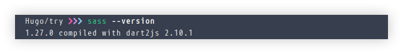
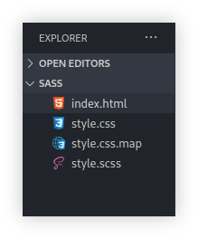
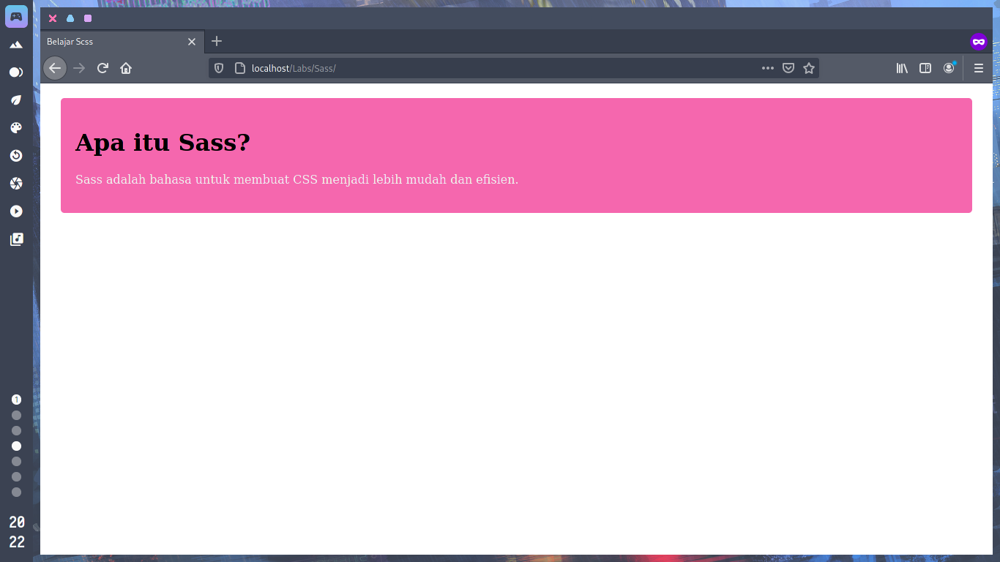

Kalai ini kita akan belajar sass,
<!--more-->

## Apa Itu Sass ?
Sass adalah bahasa scripting yang memudahkan Anda untuk menulis CSS dengan lebih mudah dan efisien.
Ada 2 cara untuk menulis Sass, sintaksis SASS dan sintaksis SCSS. Kita menggunakan sintaksis SCSS, yang mana adalah sintaksis yang lebih umum. File ekstensinya adalah .scss dan bukan .css.

## Mengapa Sass ?
Beberapa keuntungan menggunakan Sass ditunjukkan di bawah.
Pada pelajaran ini, Anda akan mempelajari keuntungan tersebut dengan detail dan bagaimana mengambil manfaatnya.

## Struktur Nesting (Sarang)
Pertama, mari kita lihat struktur nesting yang sering digunakan dalam Sass. Dengan nesting, Anda dapat menulis ulang CSS seperti dicontohkan di bawah. Dengan cara ini, Sass memungkinkan Anda untuk nesting (menyarang) selector pada selector lain. Jadi, dengan Sass, Anda tidak perlu untuk menulis selector yang sama berulang kali.

### Contoh

*index.html*
```html
<div class="header">
	<ul>
	 ...
	 ...
	</ul>
</div>
```
Ini jika kita menggunakan CSS normal
```css
.header {
	width : 100%;
}
.header ul {
	padding : 10px;
}
```
Saat kita menggunakan CSS norman kita harus menuliskan .header 2 x

Dan ini ketika menggunakan SCSS
```sass
.header{
	width : 100%;

	ul {
		padding : 10px;
	}
}
```
CSS untuk tag uk di class .header akan di perlakukan sama seperti pada .header ul.

## Keuntungan Nesting
Semakin besar site, makin berguna nesting. Terutama ketika melakukan perubahan pada nama class. Jika Anda ingin mengubah nama class header pada contoh di bawah, Anda harus melakukan perubahan di 3 lokasi dengan CSS normal, namun dengan Sass Anda hanya perlu melakukan satu perubahan.

### contoh
```css
.header {
	width : 100%;
}
.header ul {
	padding : 10px
}
.heading ul li {
	font-size : 10px;
}
```
Bisa lihat contoh di atas kita hasus membuat 3 berubahan di tiga tempat jika nama class berubah.

```sass
.header {
	width : 100%;

	ul {
		padding : 10px;

		li {
			font-size : 15px;
		}
	}
}
```

Dan ini hanya perlu 1 perubahan jika nama class berubah.

## Instalasi SASS

```
npm install -g sass
```
jika sudah selesai bisa cek dengan perintah **sass --version**



setelah itu kita bisa kompilasi SASS menjadi CSS
```
sass style.scss style.css
```

jika sudah selesai di kompilasi kita akan mendapatkan tambahan file *style.css* dan *style.css.map* hasil kompilasi



Mari kita buat contoh sederhana menggunakan sass, pertama buat file *index.html* dan *style.sass*

*index.html*
```html
<!DOCTYPE html>
<html lang="en">
<head>
    <meta charset="UTF-8">
    <meta name="viewport" content="width=device-width, initial-scale=1.0">
    <link rel="stylesheet" href="style.css">
    <title>Belajar Scss </title>
</head>
<body>
    <div class="main">
        <h1>Apa itu Sass?</h1>
        <p>Sass adalah bahasa untuk membuat CSS menjadi lebih mudah dan efisien.</p>
      </div>
</body>
</html>
```

*style.scss*
```scss
.main {
    margin: 20px;
    padding: 20px;
    border-radius: 5px;
    background-color: #f567ae;

    .h1 {
      color: #f8f8f8;
      font-size: 34px;
    }

    p {
      color: #efefef;
      font-size: 16px;
    }
  }
```
Jangan lupa untuk kompilasi SCSS nya biar bisa berjalan SCSSnya

Jika sudah selesai semua bisa jalankan di web browser kalian.

Maka tampilannya seperti berikut

