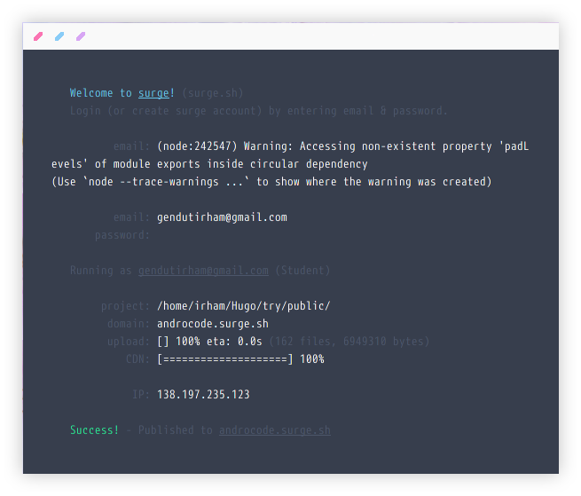

surge.sh sebuah layanan seperti hosting plus subdomain _.surge.sh_ gratis, dan hanya saja extensi file yang bisa diupload dibatasi hanya bisa file html, css, dan javascript.
<!--more-->
## Deploy Static Site pada surge.sh
 - Pastikan sudah menginstall aplikasi nodejs bisa cek disini cara installnya [Nodejs](http://nodejs.org/)
 - Kemudian, instal Surge menggunakan npm dengan menjalankan perintah berikut:
 ```bash
 npm instal -g surge
 ```
 - Sekarang, jalankan surge dari dalam direktori aplikasi atau website yang ingin dipublikasikan atau dihostingkan ke web surge. Dan masukkan Email dan password anda kemudian bisa atur nama yg ingin kalian gunakan.
 
 

 - Hasil aplikasi yang sudah di deploy [Androcode](http://androcode.surge.sh)
 Jika ingin update ringgal jalanin surge lagi.
