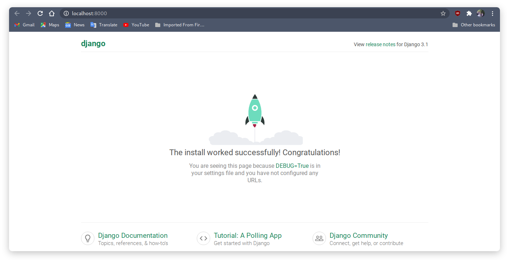

Saat ini saya lagi belajar Django, Django merupakan salah satu framework python.
Kali ini saya akan belajar instalasi django dan semoga nanti ada terusannya.

### Setup django

sudo pacman -S python


jika sudah selesai bisa masukkan perintah python di terminal maka nanti akan ada versi python yang kita gunakan

Python 3.9.2 (default, Feb 21 2021, 02:28:33) 
[GCC 10.2.0] on linux
Type "help", "copyright", "credits" or "license" for more information.
>>>


saya pada saat ini menggunakan versi 3.9.2 bisa jadi kalian nanti menggunakan versi lebih tinggi dari pubya saya, 
walaupun versi python kita berbeda tapi insyaallah nanti tidak akan terjadi apa-apa.

#### setelah ini install pip

sudo pacman -S python-pip


kemudian install virtual environment


pip install virtualenv


#### kemudian buat virtual environment 
buat folder dengan nama apa aja terserah teman"

mkdir django %% cd django


Selanjutnya kita perlu membuat dan mengaktifkan virtual environment agar kita bisa menginstal framework Django secara local atau hanya di dalam folder project kita saja. Untuk membuat virtual environment baru ketikkan perintah berikut.

kemudian buat virtual environment

virtualenv my-env


untuk mengaktifkannya virtual environment bisa masukkan perintah

source my-env/bin/activate


dan untuk menonaktifkannya masukkan perintah

deactivate


Setelah semuannya berjalan dengan lancar sekarang tinggal install Django

pip install django


jika sudah selesai kita bisa cek dengan perintah

pip list


maka kita bisa melihat apa aja yg sudah kita install


Package    Version
---------- -------
asgiref    3.3.1
Django     3.1.7
pip        21.0.1
pytz       2021.1
setuptools 53.0.0
sqlparse   0.4.1
wheel      0.36.2


### Membuat Project dan app Baru

Untuk membuat project kita bisa memasukka perintah

django-admin startproject androcode

**androcode** bisa sesuaikan dengan nama sesuka kalian
kemudian masuk ke folder project yg sudah kita buat kemudian buat app dengan perintah

python manage.py startapp crud


Untuk mengecek apakah aplikasi yg kita buat berjalan apa tidak kita bisa memasukkan perintah

python manage.py runserver


kemudian masukkan alamat url [localhost:8000](http://localhost:8000)
maka akan seperti ini

Yea sudah berhasil selanjutnya kita akan lanjutkan ya.... hehehe di tunggu.