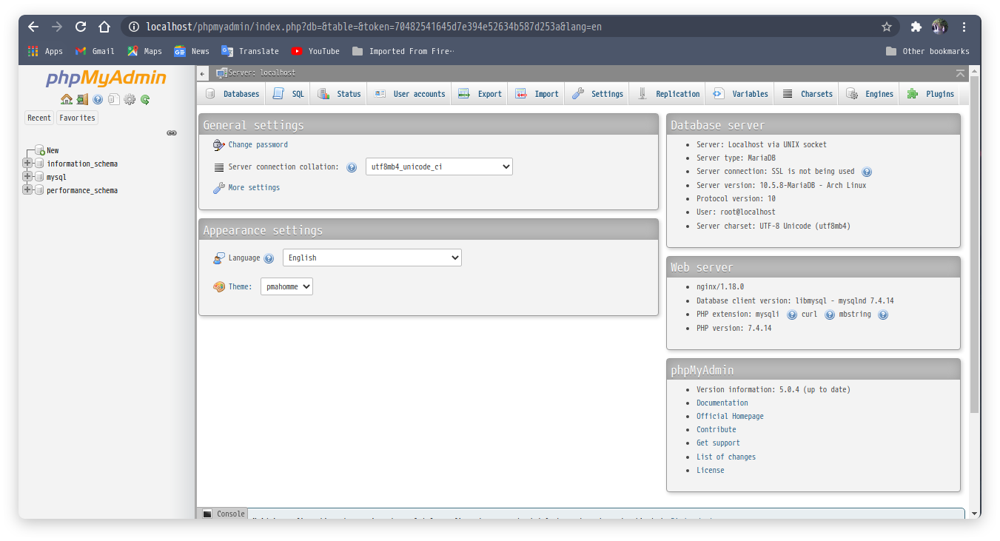

Saya meneruskan postingan sebelumnya yang membahas tentang [install nginx php dan mysql](https://androcode.netlify.app/posts/install-nginx/)
dan kali ini saya akan membagikan cara install phpmyadmin di Linux.

### Install Phpmyadmin
Untuk menginstall phpmyadmin langsung masukkan Perintah

sudo pacman -S phpmyadmin


jika sudah selesai bisa konfigurasikan PHP
yaitu pastikan modul ekstensi mysqli dan pdo_mysql sudah aktif.
Jika belum maka edit file **/etc/php/php.ini**
lalu uncomment dua baris berikut :
```ini
extension=pdo_mysql
extension=mysqli
```
lalu restart php-fpm
```zsh
sudo systemctl restart php-fpm
```
### Sub directory dengan symlink
buat symlink dari _/usr/share/webapps/phpMyadmin/_ ke lokasi _/usr/share/nginx/html/_
dengan perintah
```zsh
ln -s /usr/share/webapps/phpMyAdmin/ /usr/share/nginx/html/phpmyadmin
```
Ya kita sudah selesai instalasi phpmyadmin di linux, seharusnya jika kita buka alamat url **localhost/phpmyadmin** sudah tampil seperrti berikut 

Yea sudah berhasil.... 
jika ada yang kurang jelas bisa tanyakan di komentar.