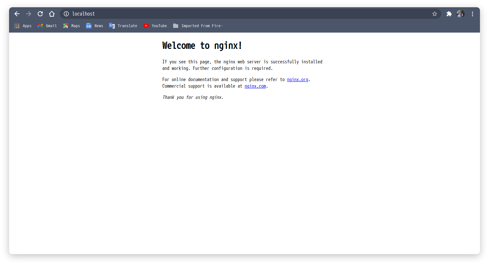
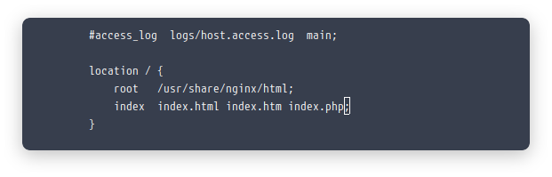
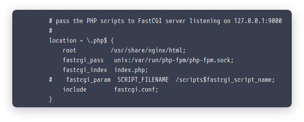
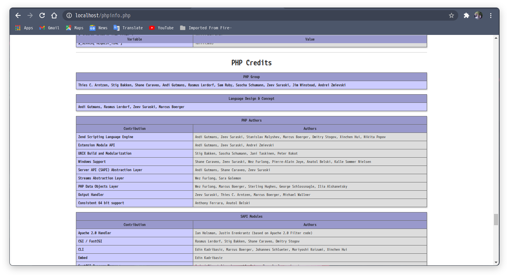

Jadi saya membuat tutorial ini setelah saya ahirnya berhasil menginstall archlinux 
setelah beberapa kali pecobaan gagal ☺.
Daripada nanti kalau saya mau install dan lupa harus browsing" dulu.
Baik kalau gitu mari kita beraksi.
### Pertama update Sistem
```bash
sudo pacman -Syu
```

### Install Nginx
```bash
sudo pacman -S nginx
```
Aktifkan nginx agar bisa start up saat booting.
```bash
sudo systemctl start nginx
```
```bash
sudo systemctl enable nginx
```
Jika proses di atas sudah selesai tanpa kendala apapun maka seharusnya jika kita
membuka *localhost* maka sudah terbuka seperti ini:


### Install PHP
Install php dengan melakukan Perintah
```bash
sudo pacman -S php php-fpm
```
Setelah menginstall php selesai kini tinggal mengatur web server kita agar dapat memanggil php-fpm.
Untuk mengedit confignya bisa jalankan perintah berikut:
```bash
sudo nano /etc/nginx/nginx.conf
```
Dan tambahkan **index.php** pada location
```conf
location / {
			root /usr/share/nginx/html;
			index index.html index.htm index.php
}
```
jadi seperti berikut :


Dan temukan tulisan berikut :
```conf
#location ~ \.php$ {
#    root           html;
#    fastcgi_pass   127.0.0.1:9000;
#    fastcgi_index  index.php;
#    fastcgi_param  SCRIPT_FILENAME  /scripts$fastcgi_script_name;
#    include        fastcgi_params;
#}
```
konfigurasikan dengan menghapus tanda pagar atau commentnya dan bisa di ganti atau di tambah seperti berikut :


setelah selesai bisa save dengan *ctrl + x kemudia y terus enter* untuk yg mengeditnya menggunakan nano.
Kemudian restart nginx nya dan jalankan service php-fpm
```bash
sudo systemctl start php-fpm
```
```bash
sudo systemctl enable php-fpm
```
```bash
sudo systemctl restart nginx
```

### Testing PHP
Untuk tes web server kita sudah berjalan atau belum bisa cek dengan buat file di _/usr/share/nginx/html/infophp.php_

agar bisa buat file di file manager dan juga copy paste maka harus melalukan permision di folder _html_ dengan cara
```sh
sudo chmod 777 -R /usr/share/nginx/html/
```
buat file dengan nama _infophp.php_ dan berikut isinya: 
```php
<?php
phpinfo();
?>
```
kemudian jalankan dengan memanggil alamat _localhost/infophp.php_
jika tampil seperti ini berarti kita sudah Berhasil


### Untuk install Mysql
untuk install mysql saya sudah pernah membuat tulisanya [Di sini](https://androcode.netlify.app/posts/mysql/)