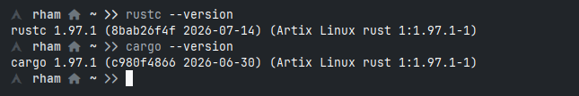

Haloo semuanya, udah lama sekali blog ini ga update hehe

sekarang saya akan melajutkan seri dari bahasa pemrograman Rust.

Jadi kita udah tau apa itu Rust, sekarang kita mau meng-install Rust itu sendiri.

# Instalisasi Build Tools

Pertama yg kita persiapkan yaitu sehat jasmani dan rohani kemudian laptop buat install Rust itu sendiri.

Install Build tools terlebih dahulu

**Debian Based**
```bash
sudo apt update && sudo apt install build-essential curl -y

```

**Fedora/CentOS**
```bash
sudo dnf groupinstall "Development Tools" && sudo dnf install curl -y
```

**Archlinux**
```bash
sudo pacman -S base-devel curl
```
 ## Install Rust

 ```bash
 curl --proto '=https' --tlsv1.2 -sSf https://sh.rustup.rs | sh
```
 
Setelah selesai prosesnya selanjutnya **Configure Your Environment PATH**

```bash
source "$HOME/.cargo/env"

```

kalo sudah sekarang kita bisa cek apakah Rust sudah terinstall di komputer kita apa belum dg perintah :
``` bash
rustc --version
cargo --version
```



Jika tampil seperti gambar di atas itu artinya kita telah sukses install Rust di komputer kita.
Selanjutnya kita akan belajar dan mengulik Bahasa Pemrograman Rust, dan sampai jumpa di postingan selanjutnya.