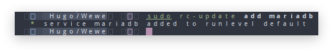
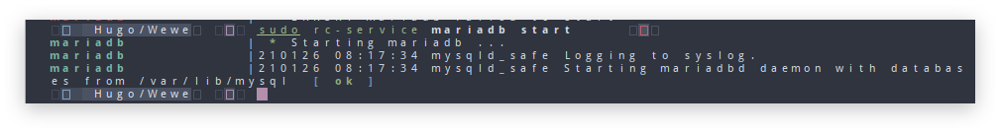
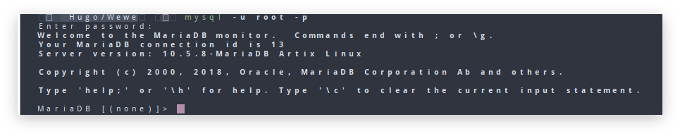

Halo Semua kali ini saya akan membuat tulisan untukku sendiri atau sukur" dapat membantu teman" \u263A.
Saya menemukan masalah ketika saya mencoba distro linux Artix(OpenRC) saya cukup bingung gimana carannya manajemen service di artix yg saya sebelumnya dari archlinux, mungkin cukup mudah karna saya cukup familiar dan sudah banyak blog" yang membahasnya.
Saya akan meenginstall Mariadb dan bagaimana menjalankan servicnya di OpenRC.

### Pertama Install Mariadb terlebih dahulu
```bash
sudo pacman -S mariadb mariadb-OpenRC
```
Dan untuk melihat daftar service bisa melalukan Perintah
```bash
rc-service -l
```

### Menambahkan Service ke runlevel
**runlevel** merupakan dimana service akan di jalankan.
Cara menambahkanservice ke runlevel
```
sudo rc-update add <nama-service>
```
atau saya menggunakan mariadb sebagai contoh di atas
```bash
sudo rc-update add mariadb
```
jika berhasil akan seperti ini:


Jika sudah karna saya menggunakan mariadb sebagai contoh maka saya harus menjalankan perintah berikut.
untuk yang tidak menggunakan mariadb bisa langsung ke step selanjutnya :
```sh
sudo mysql_install_db --user=mysql --basedir=/usr --datadir=/var/lib/mysql
```
### Menjalankan, Merestart dan Menghentikan Service
Untuk menjankan sama seperti service yg lain kita masih menggunakan perinta **start stop restart** 
untuk menjalankannya menggunakan perintah :
```bash
sudo rc-service mariadb start
```

 untuk stop
 ```bash
sudo rc-service mariadb stop
 ```
 Untuk restart
 ```bash
sudo rc-service mariadb restart
 ```

Jika sudah bisa coba masuk ke mariadb dengan perintah berikut
```bash
mysql -u root -p
```
jika sudah bisa maka akan tampil seperti berikut


Kalau sudah selesai semuannya sekian dan terimakasih.

# Referensi <br>
 - {{ newtabref  href="https://bandithijo.github.io/blog/mudah-manajemen-service-dengan-OpenRC" title="bandithijo.github.io/blog/mudah-manajemen-service-dengan-OpenRC" }} <br>
 - {{ newtabref  href="https://wiki.archlinux.org/index.php/OpenRC" title="Arch Wiki :OpenRC" }}